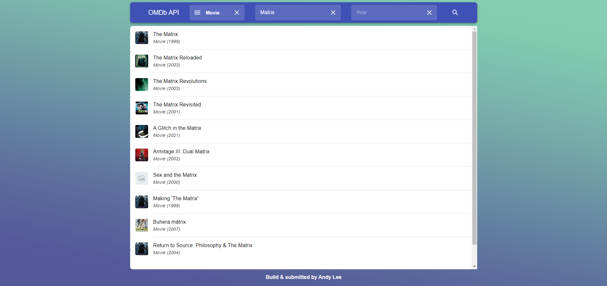
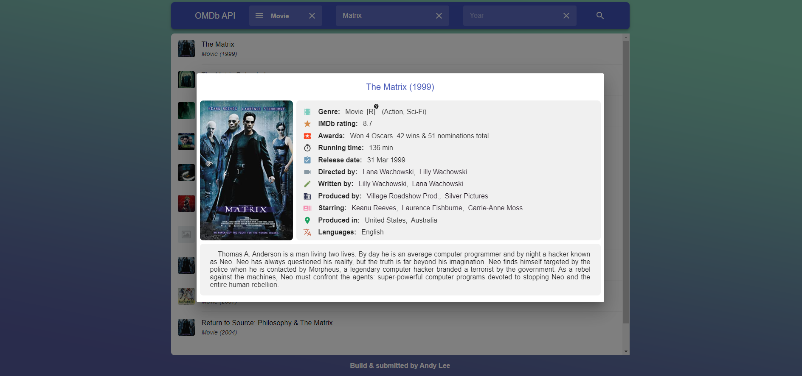
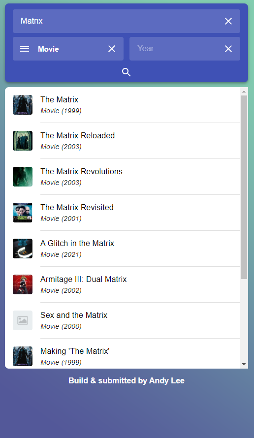
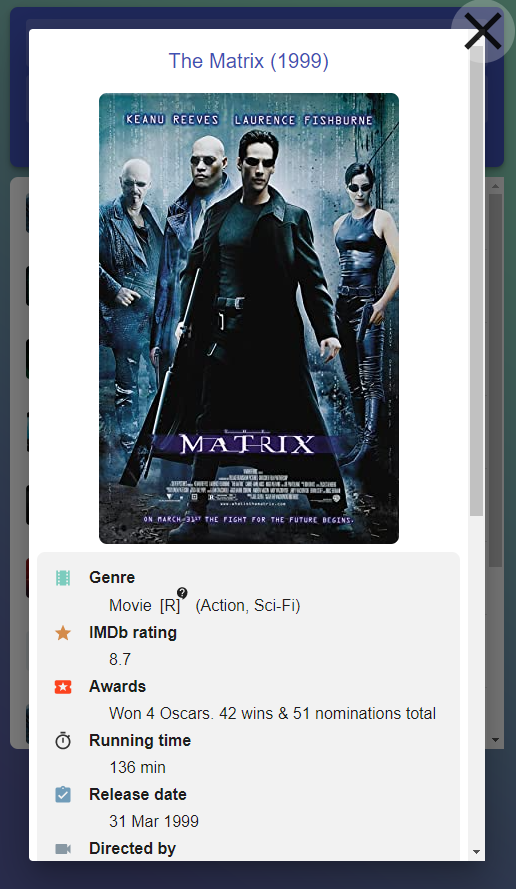
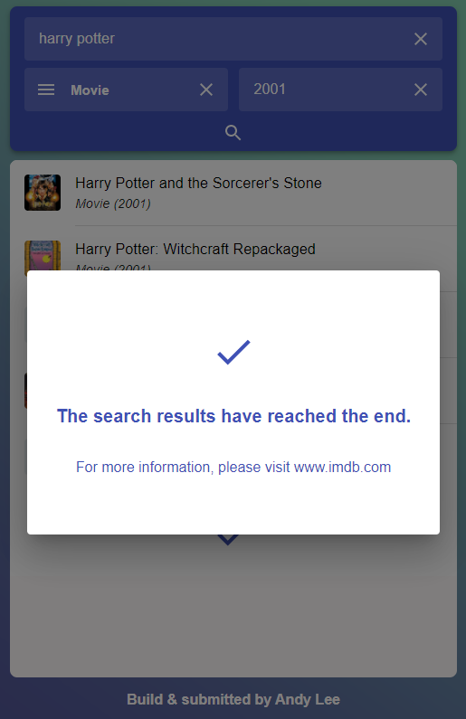

# About

This project was generated using [Nx](https://nx.dev).

A simple movie search service powered by OMDb API.
This is a demo web application built by Andy Lee, using React, Typescript, Nx Framework, Material UI and SASS.

# IMPORTANT

Please kindly use your own API key by configuring apps/react-app/src/environments/environment.ts and environment.prod.ts

# Screenshots (responsive screen)

# ⚒ Install using NPM

`npm install`, `npm run start` (localhost:4200)

# ⚒ Install using Yarn

`yarn install`, `yarn run start` (localhost:4200)